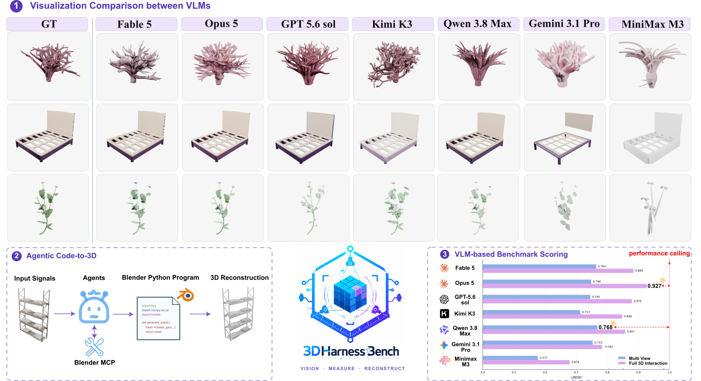

# 3DHarnessBench: Probing Agentic 3D-to-Code Capabilities of Frontier Vision-Language Models


<p align="center">
  🌐 <a href="https://llada60.github.io/3DHarnessBench/">Project Page</a> |
  📄 <a href="https://arxiv.org/abs/2609.06535">arXiv</a> |
  🤗 <a href="https://huggingface.co/datasets/lingada/3DHarnessBench">Benchmark</a>
</p>





> **Abstract:** We introduce 3DHarnessBench, a benchmark that evaluates the agentic ability of frontier vision-language models (VLMs) to recover 3D geometry as Blender Python code from a variety of inputs. Unlike previous frameworks that prompt the VLMs with a fixed input (e.g., a single rendering or a text description), 3DHarnessBench evaluates four separate harness settings that progressively enable active agentic exploration, facilitated by recent Blender MCP functionality. Our hierarchy from Single-view, Multi-view, Active Visual (arbitrary viewpoint access), and Full 3D Interaction (complete access to the target object through Blender function calls) probes the models' abilities in both visual perception and active inference, tool calling, and self-correction. We observe that the ability of all frontier models to recover 3D geometry improves significantly with richer function call access, although the improvements are strongly model-dependent, revealing highly uneven agentic 3D-to-code capabilities. We release the benchmark, code, outputs, and agent trajectories for reproducible 3D evaluation.

---

## Project Structure

```text
.
├── scripts/                    # Four benchmark entry points
│   ├── Single-view/run.py
│   ├── Multi-view/run.py
│   ├── ActiveVisual/run.py
│   └── Full3DInteraction/run.py
├── evaluation/
│   ├── evaluate.py             # Unified evaluation entry point
│   ├── core/                   # Rendering and GLB export
│   └── metrics/                # Usage, Chamfer, image and Uni3D metrics
├── raw_agents/                 # Shared runners and image-agent adapters
├── cli_agents/                 # MCP agent adapters and checkpoints
├── BlenderMCP/                 # Blender MCP services
├── prompting/                  # Image reconstruction prompts
├── skills/                     # MCP reconstruction instructions
├── packages/                   # Local VirtualGL Pixi package recipe
├── tests/                      # Lightweight, offline unit tests
├── data/benchmark/             # Downloaded benchmark instances
├── outputs/                    # Generated results and metrics
├── teaser.png                  # Paper overview figure
├── .env.example                # Blender path and API-key template
├── pyproject.toml              # Pixi dependencies and commands
├── pixi.lock                   # Locked dependency versions
├── INSTALL.md                  # Linux installation instructions
├── CONTRIBUTING.md             # Contribution and local-check workflow
└── LICENSING.md                # GPL, CC BY and bundled MIT boundaries
```

## Installation

Follow **[INSTALL.md](INSTALL.md)** to install Pixi, Blender **5.1.2** and agent
CLIs, configure `.env`, and prepare evaluation weights. The target platform is
**Linux x86-64 + NVIDIA GPU**; ActiveVisual and Full3DInteraction use Xvfb.

Run commands from the repository root (`3DHarnessBench/`). All entry points load
`.env` automatically; exported shell variables take precedence.

## Download the Benchmark

Download [3DHarnessBench from Hugging Face](https://huggingface.co/datasets/lingada/3DHarnessBench)
and place the instance directories under `data/benchmark/`, following the
[data layout](data/benchmark/README.md). The complete benchmark contains
**100 instances** with textured/grey GLBs and reference renders.

## Running 3DHarnessBench

### Single-view and Multi-view

Single-view uses one reference image (`Image_005.png` by default); Multi-view uses
the four benchmark reference images. Both generate Python, render the result,
and then edit it for the specified number of rounds.

```bash
pixi run single-view \
  --agent gpt-5-6-sol \
  --data-path data/benchmark \
  --output-dir outputs \
  --texture-renders True \
  --iterations 3 \
  --num-parallel 8
```

For **Multi-view**, replace `single-view` with `multi-view`.

- `--agent`: agent to run. Supported names:
  `gpt-6-astra`, `gpt-5-6-sol`, `kimi-k3`, `opus-5`, `fable-5`,
  `qwen3-8-max-preview`, `gemini3-1-pro`, `minimax-m3`.
- `--data-path`: benchmark directory; default **`data/benchmark`**.
- `--output-dir`: output base directory; default **`outputs`**.
- `--texture-renders`: use color references (`True`, default) or grey references
  (`False`).
- `--iterations`: editing rounds **after one initial generation**; default **3**.
  Set **0** for generation only.
- `--num-parallel`: concurrent instances; default **8**.

By default, the command runs all discoverable instances. Add `--tasks VaseFactory`
to select an instance, or `--limit 5` for the first five. Add `--dry-run` to inspect
inputs without model calls. A complete dataset should show **`Tasks: 100`**.

Repeat the same command to resume. If changing checkpoint settings such as
`--iterations`, use a new `--output-dir` or add `--overwrite` to restart.

### ActiveVisual and Full3DInteraction

ActiveVisual lets the agent inspect a restricted reference Blender and build in
a separate editable Blender. Full3DInteraction provides full MCP access to one
Blender containing the reference.

```bash
pixi run active-visual \
  --agent gpt-5-6-sol \
  --data-path data/benchmark \
  --output-dir outputs \
  --texture-renders True \
  --num-parallel 4 \
  --timeout 9600 \
  --max-retries 5
```

For **Full3DInteraction**, replace `active-visual` with `full-3d-interaction`.

- `--agent`, `--data-path`, `--output-dir`: same meanings and defaults as above.
- `--texture-renders`: load the textured reference GLB (`True`, default) or its
  grey version (`False`).
- `--num-parallel`: concurrent instances; default **4**.
- `--timeout`: seconds per CLI attempt; default **9600**, not a total run limit.
- `--max-retries`: same-session reconnections after timeout; default **5**.
  Qwen/MiniMax also use this budget for session continuations.

These modes are interactive and have no `--iterations` parameter. `--tasks`,
`--limit` and `--dry-run` work as above. Repeating a command resumes compatible
checkpoints and skips completed instances. To restart including completed work,
add `--fresh --rerun`.

## Evaluation

Use the same setting, agent, output directory and texture choice as generation:

```bash
pixi run python evaluation/evaluate.py \
  --setting Single-view \
  --agent gpt-5-6-sol \
  --data-path data/benchmark \
  --output-dir outputs \
  --texture-renders True \
  --device cuda \
  --batch-size 16 \
  --num-parallel 4
```

- `--setting`: **required**; `Single-view`, `Multi-view`, `ActiveVisual` or
  `Full3DInteraction`.
- `--agent`: **required**; the agent whose results you want to evaluate.
- `--data-path`, `--output-dir`, `--texture-renders`: same defaults as generation.
- `--device`: model inference device; default **`cuda`** (NVIDIA GPU).
- `--batch-size`: image-encoder batch size; default **16**.
- `--num-parallel`: concurrent Blender preparation jobs, not metric-model
  concurrency. Unset by default: **1** render worker and **4** GLB workers;
  supplying this option sets both counts.

Evaluation prepares missing renders/GLBs and computes usage, Chamfer, image
similarity (**SigLIP2, DINOv2, DINOv3**) and **Uni3D** metrics.

Add `--tasks VaseFactory` to evaluate a subset. Existing metric files are reused;
add `--overwrite-metrics` after changing the evaluated selection or parameters.
After changing generated scripts, add `--overwrite-artifacts --overwrite-metrics`.
Without DINOv3 access, `--image-encoders siglip2 dinov2` runs a partial encoder
evaluation; Uni3D still runs.

### Results

Generated scripts and renders are saved under:

```text
outputs/<setting>/<w_texture|wo_texture>/<agent>/<instance>/
```

Evaluation writes to the agent's `_metrics/` directory:

- **`evaluation_run.json`**: stage status and evaluated instance names/count.
- **`final_metrics.json`**: aggregate scores.
- Per-metric JSON files: detailed scores and coverage.

Check `status` and `n_instances`: evaluation selects existing generated/reference
pairs and skips unfinished image iterations. Success does not automatically
mean all **100 instances** were evaluated.

For additional options, append `--help` to any command. See
[evaluation/README.md](evaluation/README.md) for evaluation details and GLB export
limitations.

## Citation

If you find our work useful, please consider citing:

```bibtex
@misc{liu20263dharnessbench,
  title         = {3DHarnessBench: Probing Agentic 3D-to-Code Capabilities of Frontier Vision-Language Models},
  author        = {Ling Liu and Bingchen Gong and Amal Dev Parakkat and Maks Ovsjanikov},
  year          = {2026},
  eprint        = {2609.06535},
  archivePrefix = {arXiv},
  primaryClass  = {cs.CV},
  url           = {https://arxiv.org/abs/2609.06535}
}
```


## License

Project software is licensed under
[GPL-3.0-only](LICENSE). Original documentation, standalone prompt templates,
skills, project images and 3DHarnessBench content are licensed under
[CC BY 4.0](LICENSES/CC-BY-4.0.txt), attributed to `llada60`. Bundled
BlenderMCP-derived code remains under MIT. See [LICENSING.md](LICENSING.md).

Third-party models, weights and downloaded dependencies retain their own terms.
Benchmark assets, outputs, model caches and the local `.env` are excluded from
Git.
